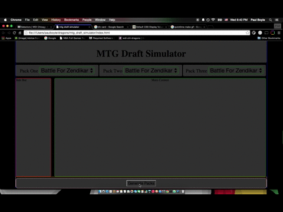

# mtg_draft_simulator
mtg draft stimulator to create random booster packs.

adding a generatePack UI button that adds a card object to the screen.

new constructor function card(cardName,cardType,cardPictureUrl,cardColor).

built stasisSnare instance of card.

